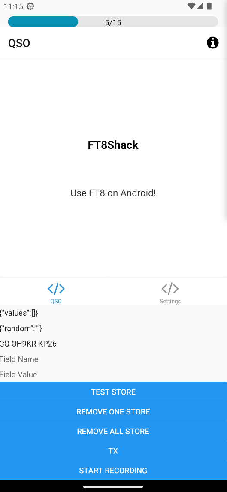

# FT8Shack for android
Use FT8 on android!

## How to dev?

- To install, 'yarn install'
- To run, 'yarn run android' or 'expo start'

## Currentish status

### Ready:
- FT8 modulation (textInput-to-audioOutput)
- FT8 demodulation (audioInput-to-receivedMessages)
- 15 second packet timer on UI
- Show received messages (not visible on the demo picture below)

### Critical TODO to achieve MVP
- Use timer to start and stop packet receiving and sending
- Get time from the GNSS (or from the NTP if lazy)
- Certificate yelling :( from Google when installing from github-actions[bot] created APK

### Current nice-to-have features
- Do not force user to type whole packets including own callsign, do something for the user
- Select receiving participant callsign to be the one that is clicked from the received messages list
- Settings for instance for setting VOX preamble

 

    

 